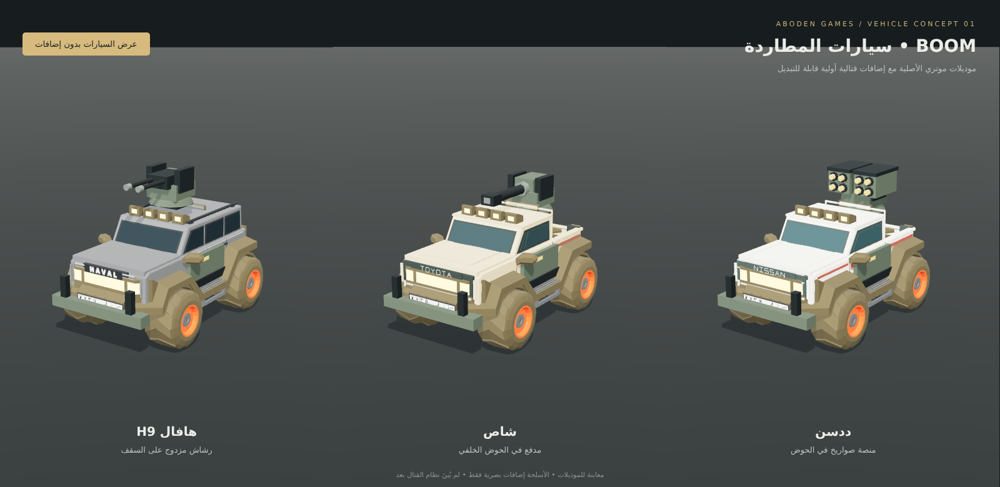

# BOOM — سيارات المطاردة

بداية مستقلة لفكرة مطاردة وقتال السيارات من عبودين قيمز. نُقلت موديلات موتري الحالية، وهي **هافال H9 والشاص والددسن**، وهيّئت لفيزياء وتحكم هجولة.

هذه النسخة حزمة موديلات ومعاينة واختبار توافق. الأسلحة بصرية وقابلة للحركة عبر محاورها؛ إطلاق النار والمقذوفات والضرر والمطاردة لم تُنفّذ بعد.



## الملفات

| السيارة | النسخة العادية | النسخة القتالية الأولية |
|---|---|---|
| هافال H9 | `models/motri-h9-base.glb` | `models/motri-h9-combat.glb` — رشاش مزدوج على السقف |
| شاص | `models/motri-shas-base.glb` | `models/motri-shas-combat.glb` — مدفع في الحوض |
| ددسن | `models/motri-datsun-base.glb` | `models/motri-datsun-combat.glb` — منصة صواريخ في الحوض |

النسخ القتالية تحتفظ بتصميم السيارة وتضيف حماية للأبواب والصدام وقاعدة للسلاح. مولدات الهياكل والأسلحة في `src/` قابلة للتعديل. الملفات الأصلية المرجعية في `originals/`.

## المعاينة

من هذا المجلد شغّل `python3 -m http.server 8000` ثم افتح `http://localhost:8000/`.

تظهر السيارات الثلاث على الكمبيوتر. على الجوال اضغط اسم السيارة أسفل الشاشة لعرضها. الزر العلوي يقارن الشكل العادي مع التجهيز القتالي. المعاينة تستخدم Three.js 0.185.1 من CDN، وتحتاج اتصال إنترنت. الموقع ثابت ولا يحتاج إلى بناء.

## التوافق مع هجولة

- حُوّل اتجاه المقدمة من `+X` في موتري إلى `+Z` في هجولة، مع إبقاء `+Y` إلى الأعلى.
- لكل سيارة مجموعة `body` وأربع مجموعات عجلات منفصلة: `wheel-front-left`, `wheel-front-right`, `wheel-back-left`, `wheel-back-right`.
- لا تتضمن أسماء الأجزاء الداخلية كلمة `wheel`، لتجنب تدوير القطعة مرتين في كود هجولة.
- المحاور نظيفة، والعجلات موضوعة عند الأرض `y=0`؛ نصف قطر العجلة محفوظ في `userData`.
- السلاح والحماية تابعان للهيكل، فيتحركان معه عند الميل والتعليق. `weapon-yaw` للدوران، و`weapon-pitch` للارتفاع، و`muzzle-*` نقاط خروج المقذوفات المستقبلية.
- الأسلحة إضافات شكلية؛ لا تغيّر الكتلة أو مركز الثقل تلقائيًا.

مثال تحميل باستخدام فئة `Vehicle` الحالية في هجولة:

```js
import { GLTFLoader } from 'three/addons/loaders/GLTFLoader.js';
import { Vehicle } from './verification/Vehicle.js';
import { createHajwalaModel } from './src/prepareMotriVehicle.js';

const { scene } = await new GLTFLoader().loadAsync('models/motri-h9-combat.glb');
const vehicle = new Vehicle();
vehicle.physicsWorld = world;
vehicle.rigidBody = sphereBody;
scene3D.add(vehicle.init(createHajwalaModel(scene, 0.5)));
// The normal Hajwala loop calls updateWorld(...) then vehicle.update(dt, input).
```

لا تطبّق تصغير `0.5` مرتين إذا كان محمّل اللعبة يصغّر موديلات السيارات مسبقًا. عند تمرير الموديل إلى محمّل هجولة الحالي تستخدم إعداداته المعتادة، وعند التحميل المستقل يستخدم المثال أعلاه.

## الفحص المنفذ

`npm install` ثم `npm run verify`.

الاختبار يستخدم Three.js 0.185.1 وCrashcat 0.0.3 وكود `Vehicle.js` و`Controls.js` الأصلي من هجولة، ومقتطفَي إنشاء العالم وجسم التصادم دون تغيير. تقارن الحركة بسيارة هجولة الصفراء الأصلية، على أرض مستوية وبنفس مدخلات التحكم.

نجحت النسخ الست في 600 إطار لكل نسخة: التسارع، الالتفاف، الهاندبريك، الرجوع، واتجاهات اللمس. الفرق في المسار عن المرجع صفر في هذا الاختبار. كذلك فُحصت مدخلات لوحة المفاتيح ويد التحكم ومتجه اللمس، وجود أربع عجلات، دوران العجلات، واتصال السلاح بالهيكل. التفاصيل في `verification/compatibility-results.json`، وإحصاءات الشكل في `verification/model-stats.json`.

هذا اختبار برمجي محلي ومعاينة WebGL؛ ليس قياس أداء على آيفون أو أندرويد حقيقي، وليس اختبارًا لنظام قتال أو لعب جماعي.

## ما تحتاجه اللعبة بعد هذه البداية

فيزياء هجولة تحرّك كرة مخفية. هي مناسبة للقيادة الأركيدية الحالية، لكنها لا تمثّل مقدمة السيارة وجوانبها والأسلحة بدقة. يحتاج القتال إلى مناطق إصابة للهيكل والأسلحة، ونظام صحة وضرر ومقذوفات، ثم خصوم للمطاردة. إذا كان المطلوب صدم واقعي، يلزم تطوير جسم التصادم والاستجابة مع الحفاظ على إحساس القيادة.

النسخ القتالية تتراوح بين نحو 6.7 و7.3 آلاف مثلث، لكنها تحتوي 31–35 استدعاء رسم للموديل الواحد قبل الظلال. لا نفترض ملاءمة أعداد كبيرة من السيارات على الجوال دون قياس، وتوحيد الخامات وتقليل الاستدعاءات خطوة لاحقة عند تحديد عدد الخصوم.

## المصادر

- [Motri](https://github.com/3wasfnjd/Motri/tree/ee7e01dfe848f1bc7e857d51bcee2e687bee21eb): `static/vehicle/default.glb`، ومولدات `PickupVehicleBody` و`ShasVehicleBody` و`DatsunVehicleBody`. استُخدمت نسخة اللعبة الحالية بعد التراجع عن VR.
- [hajwala](https://github.com/3wasfnjd/hajwala/tree/4c9e421b469118c353724944a3b1465a0c1c0fc0): القيادة والتحكم وإنشاء العالم وجسم التصادم وسيارة المقارنة.
- الملف `resources/models/Haval_H9_Motri2.glb` ليس مصدر النقل؛ لم يُستخدم لأنه ليس موديل اللعب الحالي.
- إشعارات MIT الأصلية محفوظة في `licenses/`. لم تُنقل مكتبات اللعب الجماعي أو مشروع العالم الكامل.
