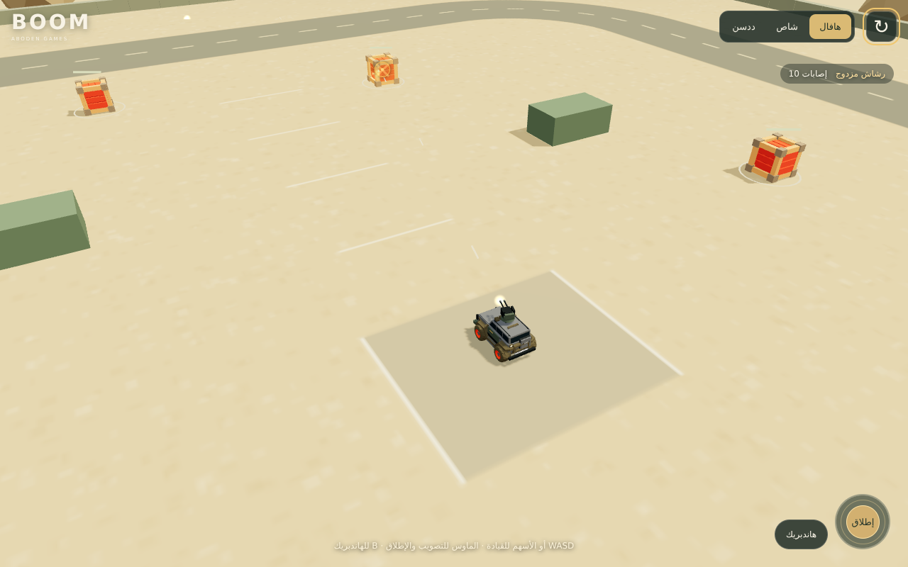

# BOOM — ساحة تجربة السيارات

ساحة قابلة للعب من **عبودين قيمز** لتجربة سيارات موتري بقيادة هجولة، والتصويب وإطلاق الأسلحة على أهداف.

**[افتح اللعبة](https://3wasfnjd.github.io/Boom/)** · [معرض الموديلات](https://3wasfnjd.github.io/Boom/garage.html)



## الموجود الآن

- أرضية مستوية جديدة، ومسار التفاف، وحواجز وحدود للساحة. الأرضية مخصصة للاختبار، وليست خريطة موتري الكاملة.
- تبديل مباشر بين هافال H9 والشاص والددسن؛ نفس قيادة هجولة وتسارعها والتفافها والهاندبريك، مع أربع عجلات متحركة وتعليق الهيكل.
- رشاش الهافال، ومدفع الشاص، وصواريخ الددسن: دوران السلاح، رفع السبطانة، مقذوفات مرئية، ارتداد بصري، مؤثرات وصوت إطلاق.
- ستة صناديق من موتري كأهداف لها صحة وضرر. يعود الصندوق المدمر بعد ست ثوانٍ، وزر ↻ يعيد السيارة والأهداف.
- التصادم المستمر للمقذوفات يمنع تجاوز الهدف بين إطارين. الحواجز تصد الطلقات وتحجب الضرر المحيطي للمدفع والصواريخ.
- تحكم باللمس للقيادة والتصويب والإطلاق معًا. التبديل بين التطبيقات أو إلغاء اللمسة يحرر المدخلات.

هذه مرحلة اختبار قيادة ورماية بأهداف ثابتة. الذخيرة غير محدودة. لا تتضمن هذه النسخة خصوم مطاردة أو صحة للسيارة أو لعبًا جماعيًا؛ الصواريخ غير موجهة، والمقذوفات تستخدم مسارًا أركيديًا مستقيمًا.

## التحكم

| الجهاز | القيادة | التصويب والإطلاق | الهاندبريك |
|---|---|---|---|
| الكمبيوتر | WASD أو الأسهم؛ S للفرملة ثم الرجوع | الماوس للتصويب وزره الأيسر للإطلاق، أو Space مع مساعدة التصويب | B |
| الجوال | اسحب العصا اليسرى نحو وجهتك | اضغط دائرة «إطلاق» لمساعدة التصويب، أو اسحبها لتوجيه السلاح | زر «هاندبريك» |
| يد التحكم | العصا اليسرى للتوجيه، RT للتسارع وLT للرجوع | العصا اليمنى للتصويب وRB للإطلاق | LB |

الأزرار العلوية أو المفاتيح 1 / 2 / 3 تبدّل السيارة. زر ↻ أو R يعيد التجربة. مساعدة التصويب تختار هدفًا قريبًا أمام السيارة دون حاجز بينهما.

## التشغيل والتعديل

التشغيل المباشر لا يحتاج CDN أو عملية بناء: الحزمة `app.min.js` والموديلات والخامات موجودة في المستودع.

```sh
python3 -m http.server 8000
# افتح http://localhost:8000/
```

بعد تعديل ملفات المصدر:

```sh
npm ci
npm run build
npm run verify
```

ارفع `app.min.js` مع ملفات المصدر بعد كل بناء. GitHub Pages يعرض `index.html`؛ `garage.html` يحتفظ بمعاينة الموديلات السابقة، وهي تستخدم Three.js من CDN.

| الملف | المهمة |
|---|---|
| `src/main.js` | التحميل، حلقة الفيزياء الثابتة 60 هرتز، الكاميرا، تبديل السيارات وإعادة التجربة |
| `src/Arena.js` | الأرضية والحواجز، أهداف موتري وصحتها وإعادتها |
| `src/CombatInput.js` | مدخلات الرماية واللمس فوق تحكم هجولة |
| `src/CombatSystem.js` | التصويب والمقذوفات والضرر ومؤثرات الأسلحة |
| `src/ShotCollision.js` | اختيار أول اصطدام على مسار المقذوف |
| `src/CombatKit.js` | مولد الأجزاء البصرية للأسلحة والحماية |
| `verification/Vehicle.js`, `Controls.js` | مصدر قيادة وتحكم هجولة المحفوظ دون تعديل |

## الموديلات

| السيارة | النسخة العادية | النسخة القتالية |
|---|---|---|
| هافال H9 | `models/motri-h9-base.glb` | `models/motri-h9-combat.glb` — رشاش مزدوج على السقف |
| شاص | `models/motri-shas-base.glb` | `models/motri-shas-combat.glb` — مدفع في الحوض |
| ددسن | `models/motri-datsun-base.glb` | `models/motri-datsun-combat.glb` — منصة صواريخ في الحوض |

حُوّل اتجاه المقدمة من +X إلى +Z، مع +Y للأعلى، ومجموعة `body` وأربع مجموعات عجلات بمحاور نظيفة. أسماء العجلات هي `wheel-front-left/right` و`wheel-back-left/right`. داخل الهيكل توجد `mount-primary` و`weapon-yaw` و`weapon-pitch` ونقاط خروج `muzzle-*`.

`createHajwalaModel(scene, .5)` في `src/prepareMotriVehicle.js` يغلف الموديل بالمقياس المناسب. لا تطبق تصغير 0.5 مرتين. ملفات GLB تتضمن هندسة السلاح ومحاوره، ونظام الإطلاق منفصل عنها في `CombatSystem.js`.

## التحقق

`npm run verify` يقارن النسخ الست بسيارة هجولة الصفراء الأصلية على أرض مستوية، خلال 600 إطار لكل نسخة، ويختبر مدخلات الكيبورد واللمس ويد التحكم. الفرق في المسار عن المرجع صفر في هذا الاختبار. يتضمن أيضًا ثمانية فحوص لتصادم المقذوفات، منها تجاوز الأهداف الرفيعة وساتر أقرب من الهدف.

لاختبار المتصفح محليًا:

```sh
npx playwright install chromium
npm run verify:browser
```

`verification/arena-results.json` يسجل اختبار WebGL للسيارات الثلاث والرماية والضرر وعودة الأهداف، وحجب الرماية بالحواجز، وإعادة التجربة، وثبات موارد الرسوم عند تبديل السيارات. اختبار اللمس يرسل لمسات متزامنة حقيقية عبر بروتوكول المتصفح للقيادة والإطلاق والهاندبريك، ويفحص الإلغاء وفقدان التركيز. المعاينات تشمل 390×844 و844×390.

هذه فحوص Chromium بمحاكاة شاشة ولمس، وليست قياس أداء على هاتف فعلي. الموديل الواحد نحو 6.7–7.3 آلاف مثلث و31–35 استدعاء رسم قبل الظلال. نعرض سيارة واحدة في هذه الساحة، ونحمّل البقية عند اختيارها، ونستخدم عددًا ثابتًا للمقذوفات والمؤثرات.

فيزياء هجولة تحرك كرة مخفية؛ تصادمها مع الحواجز لا يطابق مقدمة السيارة وجوانبها بدقة. تطوير الصدم وصحة السيارات وخصوم المطاردة يحتاج مرحلة تالية.

## المصادر

- [Motri، النسخة ee7e01d](https://github.com/3wasfnjd/Motri/tree/ee7e01dfe848f1bc7e857d51bcee2e687bee21eb): موديل اللعب الحالي `static/vehicle/default.glb` ومولدات هياكل الشاص والددسن. لم يُستخدم موديل `resources/models/Haval_H9_Motri2.glb`.
- صندوق الهدف `models/world/motri-crate.glb` من `static/explosiveCrates/explosiveCrates.glb` في نفس نسخة موتري. يعاد استخدام هندسته وخامته؛ الضرر والمؤثرات في الساحة الجديدة.
- [hajwala، النسخة 4c9e421](https://github.com/3wasfnjd/hajwala/tree/4c9e421b469118c353724944a3b1465a0c1c0fc0): `Vehicle` و`Controls` ومقتطفا إنشاء العالم وجسم التصادم وسيارة المقارنة.
- Three.js 0.185.1 وCrashcat 0.0.3، مع Mathcat. الإصدارات مثبتة في `package-lock.json` وإشعارات MIT في `licenses/`.
- لم تُنقل مكونات اللعب الجماعي ولم يُعدّل مستودعا موتري أو هجولة.
