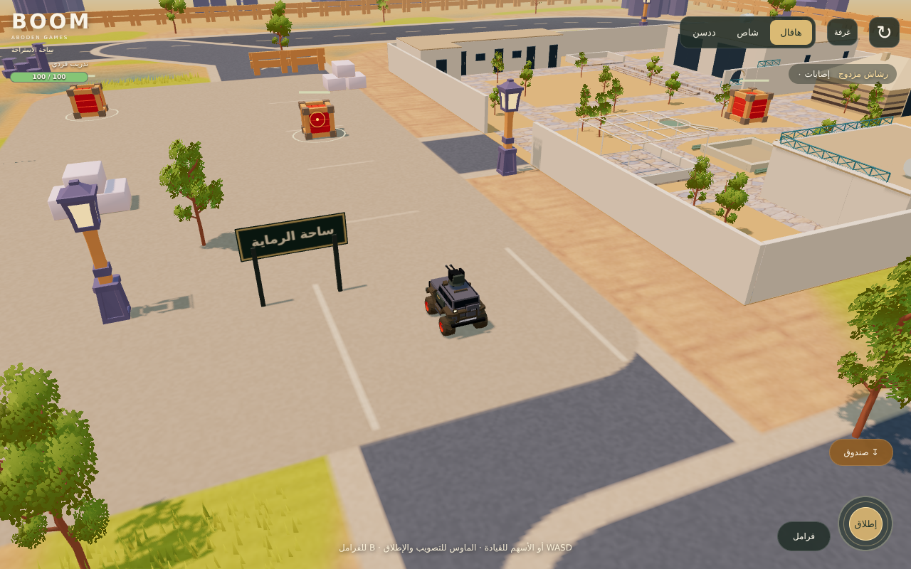

# BOOM — ساحة الاستراحة

ساحة قابلة للعب من **عبودين قيمز** لتجربة سيارات موتري بفيزياء وتعليق وتحكم موتري (Rapier)، والتصويب وإطلاق الأسلحة على أهداف.

**[افتح اللعبة](https://3wasfnjd.github.io/Boom/)** · [معرض الموديلات](https://3wasfnjd.github.io/Boom/garage.html)



## الموجود الآن

- عشب مجسّم يتحرك بالرياح ويتباعد عند مرور السيارة، موزّع من صورة بيانات موتري وبعيد عن الطرق والمباني.
- أوراق أشجار بخامة موتري الأصلية، ومطر مائل بالرياح ورذاذ على الأسطح وصوت مطر منخفض بعد أول تفاعل.
- دورة نهار وغروب وليل وفجر، مع تحرّك اتجاه الإضاءة وتغيّر الضباب والسماء والسحب وظلالها، وتوهج أعمدة الإنارة ليلًا.

- أرض من بيانات تضاريس موتري الأصلية، مع مناطق رمل وعشب ومنخفضات، وكثبان مستخرجة من خوارزمية موتري. تتدرج الارتفاعات في النسخة الحالية من نحو −1.04 إلى +1.42 وحدة.
- استراحة موتري بمبانيها وساحاتها وبوابتها الأصلية، مع مخرج جانبي جديد للمطاردات؛ جسر خشبي فوق قناة منخفضة، وصخور وأشجار وفوانيس وحواجز من موديلات موتري.
- مسار دائري وطرق تصل ساحة الرماية بالاستراحة والجسر ومنطقة الكثبان والصخور. مناطق الرماية والمداخل مستوية، مع انتقال تدريجي إلى التضاريس.
- السطح المرئي وتصادم السيارات ومقذوفات الأسلحة تستخدم شبكة الارتفاع نفسها. يتحدد ميل الهيكل من جسم السيارة الفيزيائي، وتتحرك كل عجلة بطول تعليقها الفعلي؛ أُلغي الميل البصري المصطنع.
- تبديل مباشر بين هافال H9 والشاص والددسن، مع جسم سيارة كامل وأربع عجلات بتعليق مستقل عبر Rapier 0.17.3. نُقل متحكم موتري وإعداداته، مع تحويل وحدات الساحة واتجاه الموديلات.
- رشاش الهافال، ومدفع الشاص، وصواريخ الددسن: دوران السلاح، رفع السبطانة، مقذوفات مرئية، ارتداد بصري، مؤثرات وصوت إطلاق.
- ستة صناديق من موتري كأهداف لها صحة وضرر. يعود الصندوق المدمر بعد ست ثوانٍ، وزر ↻ يعيد السيارة والأهداف.
- التصادم المستمر للمقذوفات يمنع تجاوز الهدف بين إطارين. الحواجز تصد الطلقات وتحجب الضرر المحيطي للمدفع والصواريخ.
- تحكم باللمس للقيادة والتصويب والإطلاق معًا. التبديل بين التطبيقات أو إلغاء اللمسة يحرر المدخلات.

هذا اقتطاع وتكييف لعناصر وأرض موتري في ساحة جديدة بمقاس 100×100، وحدود لعب 92×92؛ لم تُنقل خريطة موتري كاملة أو نظام المياه الخاص بها. نُقلت المؤثرات النباتية والطقس بتكييف WebGL في الإصدار 0.6. تتضمن الساحة أهدافًا ثابتة وقتالًا بين اللاعبين وصحة للسيارات. لا يوجد خصوم يتحكم بهم الذكاء الاصطناعي. الذخيرة غير محدودة؛ الصواريخ غير موجهة، والمقذوفات تستخدم مسارًا أركيديًا مستقيمًا.

## التحكم

| الجهاز | القيادة | التصويب والإطلاق | الفرامل |
|---|---|---|---|
| الكمبيوتر | WASD أو الأسهم؛ S للفرملة ثم الرجوع، Shift للتعزيز | الماوس للتصويب وزره الأيسر للإطلاق، أو Space مع مساعدة التصويب | B |
| الجوال | عصا عائمة في الجزء السفلي الأيسر: اسحب أعلى للبنزين وأسفل للفرملة ثم الريوس، ومائلًا للجمع بين القيادة واللف. رفع الإصبع يحرر البنزين ويبطئ السيارة | اضغط دائرة «إطلاق» لمساعدة التصويب، أو اسحبها لتوجيه السلاح | زر «فرامل» |
| يد التحكم | العصا اليسرى للتوجيه، RT للتسارع وLT للرجوع، الدائرة/B للتعزيز | العصا اليمنى للتصويب وRB للإطلاق | المربع/X أو LB |

عصا اللمس تدريجية ومرتبطة باتجاه السيارة، والكاميرا المرتفعة تدور خلف السيارة بسلاسة دون الانقلاب للأمام عند الريوس. القيادة والرماية تعملان بإصبعين. عدّاد «القتل» يعرض قتل اللاعبين المعتمد من الخادم ولا يحسب صناديق التدريب. حلقة سماوية وعلامة علوية متحركة تميّزان سيارتك محليًا وتختفيان أثناء التحطم.

الأزرار العلوية أو المفاتيح 1 / 2 / 3 تبدّل السيارة. زر ↻ أو R يعيد التجربة. مساعدة التصويب تختار هدفًا قريبًا أمام السيارة دون حاجز بينهما.

## التشغيل والتعديل

التشغيل المباشر لا يحتاج CDN أو عملية بناء: الحزمة `app.min.js` والموديلات والخامات موجودة في المستودع.

```sh
python3 -m http.server 8000
# افتح http://localhost:8000/
```

بعد تعديل ملفات المصدر:

```sh
npm ci
npm run build
npm run verify
```

ارفع `app.min.js` مع ملفات المصدر بعد كل بناء. GitHub Pages يعرض `index.html`؛ `garage.html` يحتفظ بمعاينة الموديلات السابقة، وهي تستخدم Three.js من CDN.

| الملف | المهمة |
|---|---|
| `src/main.js` | التحميل، حلقة الفيزياء الثابتة 60 هرتز، الكاميرا، تبديل السيارات وإعادة التجربة |
| `src/Arena.js` | أجسام التصادم، أهداف موتري وصحتها وإعادتها |
| `src/MotriWorld.js` | استراحة موتري وعناصر العالم وتجميع العناصر المتكررة |
| `src/TerrainSurface.js` | تكييف الأرض والكثبان، شبكة التصادم، ارتفاعات المقذوفات |
| `src/WorldLayout.js` | مواقع المسارات والمداخل والأهداف وخامة الطرق |
| `src/motri/DunesField.js` | مصدر توليد كثبان موتري، محفوظ دون تعديل |
| `src/CombatInput.js` | مدخلات الرماية واللمس فوق تحكم هجولة |
| `src/CombatSystem.js` | التصويب والمقذوفات والضرر ومؤثرات الأسلحة |
| `src/ShotCollision.js` | اختيار أول اصطدام على مسار المقذوف |
| `src/CombatKit.js` | مولد الأجزاء البصرية للأسلحة والحماية |
| `src/PhysicsWorld.js` | عالم Rapier وأجسام التصادم وتحويل الوحدات |
| `src/MotriVehicle.js` | ربط جسم موتري وتعليق عجلاته بالموديلات والأسلحة |
| `src/motri/PhysicsVehicle.js`, `VehicleRest.js` | متحكم موتري الأصلي وتهدئة السيارة عند التوقف |
| `src/MotriControls.js` | قواعد التوجيه والتسارع والرجوع من موتري |
| `verification/Vehicle.js`, `Controls.js` | مرجع هجولة القديم لاختبار الموديلات فقط؛ غير مستخدم في اللعبة |

## الموديلات

| السيارة | النسخة العادية | النسخة القتالية |
|---|---|---|
| هافال H9 | `models/motri-h9-base.glb` | `models/motri-h9-combat.glb` — رشاش مزدوج على السقف |
| شاص | `models/motri-shas-base.glb` | `models/motri-shas-combat.glb` — مدفع في الحوض |
| ددسن | `models/motri-datsun-base.glb` | `models/motri-datsun-combat.glb` — منصة صواريخ في الحوض |

حُوّل اتجاه المقدمة من +X إلى +Z، مع +Y للأعلى، ومجموعة `body` وأربع مجموعات عجلات بمحاور نظيفة. أسماء العجلات هي `wheel-front-left/right` و`wheel-back-left/right`. داخل الهيكل توجد `mount-primary` و`weapon-yaw` و`weapon-pitch` ونقاط خروج `muzzle-*`.

تستخدم النسخة الحالية `MotriVehicle` بمقياس عرض 0.5. تبقى الفيزياء بوحدات موتري الأصلية واتجاه +X، وتتحول الأرض إلى تلك الوحدات بالمضاعفة قبل إنشاء التصادم. لا تطبق التصغير مرتين. بقيت `createHajwalaModel` لأدوات المقارنة القديمة فقط. ملفات GLB تتضمن هندسة السلاح ومحاوره، ونظام الإطلاق منفصل عنها في `CombatSystem.js`.

## التحقق

`npm run verify` يفحص Rapier وتعليق العجلات الأربع، ثبات السيارة عند التوقف، التسارع والفرملة والرجوع، التصادم بجدار رفيع وصعود سطح مائل مع تماس العجلات الفعلي. يتضمن أيضًا قواعد تحكم اللمس وعشرة فحوص لتصادم المقذوفات. النتائج في `verification/motri-physics-results.json`.

اختبار `npm run verify:legacy` اختياري للمقارنة التاريخية بين الموديلات الست وقيادة هجولة على أرض مستوية؛ لا يمثل فيزياء النسخة الحالية.

لاختبار المتصفح محليًا:

```sh
npx playwright install chromium
npm run verify:browser
npm run verify:world
```

`verification/arena-results.json` يسجل اختبار WebGL للسيارات الثلاث والرماية والضرر وعودة الأهداف، وحجب الرماية بالحواجز، وإعادة التجربة، وثبات موارد الرسوم عند تبديل السيارات. اختبار اللمس يرسل لمسات متزامنة حقيقية عبر بروتوكول المتصفح للقيادة والإطلاق والفرامل، ويفحص الإلغاء وفقدان التركيز. المعاينات تشمل 390×844 و844×390.

`verification/world-results.json` يسجل صعود السيارات الثلاث للكثبان ونزولها، عبور الجسر فوق القناة، دخول الاستراحة والخروج من الفتحة الجانبية، اصطدام السيارة بالجدار المغلق ومرور المقذوف عبر المخرج. ويتحقق من اعتراض الكثبان للطلقات ومن إصابة المنخفض عند ارتفاعه الحقيقي.

هذه فحوص Chromium بمحاكاة شاشة ولمس، وليست قياس أداء على هاتف فعلي. الموديل الواحد نحو 6.7–7.3 آلاف مثلث و31–35 استدعاء رسم قبل الظلال. نحمّل موديلات السيارات عند الحاجة، وتعرض الغرفة سيارة لكل لاعب، ونستخدم عددًا ثابتًا للمقذوفات والمؤثرات. عناصر العالم المتكررة موزعة على 10 دفعات رسم، وشبكة التضاريس 18,432 مثلثًا. إجمالي العالم والسيارة والظلال أعلى من أرقام السيارة وحدها، ولا تعني هذه الأعداد ضمان معدل إطارات معين.

تستخدم النسخة الحالية تصادمًا مركبًا للهيكل وتعليقًا بالعجلات بدل الكرة المخفية. تفاصيل الهيكل الفيزيائي تقريبية، وليست شبكة كل قطعة من الموديل. أُضيفت صحة السيارات والقتال الجماعي في الإصدار 0.5؛ عنوان خادم Boom مضبوط كما هو موضح أدناه.

ملف Rapier WASM المحلي نحو 1.7 ميجابايت ويُحمّل في البداية؛ لم تعد حزمة التشغيل تتضمن Crashcat. لا تعني الاختبارات ضمان سلاسة على هاتف فعلي.

## المصادر

- [Motri، النسخة ee7e01d](https://github.com/3wasfnjd/Motri/tree/ee7e01dfe848f1bc7e857d51bcee2e687bee21eb): موديل اللعب الحالي `static/vehicle/default.glb` ومولدات هياكل الشاص والددسن. لم يُستخدم موديل `resources/models/Haval_H9_Motri2.glb`.
- صندوق الهدف `models/world/motri-crate.glb` من `static/explosiveCrates/explosiveCrates.glb` في نفس نسخة موتري. يعاد استخدام هندسته وخامته؛ الضرر والمؤثرات في الساحة الجديدة.
- [hajwala، النسخة 4c9e421](https://github.com/3wasfnjd/hajwala/tree/4c9e421b469118c353724944a3b1465a0c1c0fc0): `Vehicle` و`Controls` ومقتطفا إنشاء العالم وجسم التصادم وسيارة المقارنة.
- أصول العالم من نفس نسخة Motri: `rest-house`, `scenery`, `fences`, `bricks`, `poleLights`, `oakTrees`، وصورتا بيانات `terrain/terrain.png` و`floor/slabs.png`. الارتفاعات مأخوذة من رؤوس `terrain/terrain.glb`؛ أُعيد ترتيبها فقط في `motri-heightfield.bin`. [سجل المصدر والبصمات](verification/world-assets.json).
- لإعادة الاستخراج: `python3 scripts/extract-world-assets.py /path/to/Motri`. يختار السكربت جذور الموديلات المطلوبة ويحافظ على بياناتها الهندسية. موقع الاستراحة وحجمها والمخرج الجانبي وترتيب العناصر من تعديلات Boom.
- اقتُبست ألوان الأرض والاستراحة من مصادر موتري مع خامات WebGL مبسطة؛ تُستخدم مواقع تيجان الأشجار الأصلية مع أوراق مجمعة وخامة `foliageSDF.png` الأصلية، بعد تكييف `Foliage.js` إلى WebGL. تصادم الصخور صناديق تحيط بالمجسمات المساعدة، وليس تفاصيل الصخور الدقيقة.
- Draco 1.5.7 لفك ضغط موديلات العالم، بملف WASM محلي وعامل واحد يُغلق بعد التحميل. ترخيص Apache-2.0 في `licenses/Draco-Apache-2.0.txt`.
- تفاصيل نقل المتحكم والوحدات والتحكم: [motri-port.json](verification/motri-port.json). سبق هذا التحديث إصدار الكرة المخفية `e37bce3`، وهو محفوظ في تاريخ Git.
- Three.js 0.185.1 وRapier 0.17.3؛ ترخيص Rapier Apache-2.0 في `licenses/Rapier-Apache-2.0.txt`. Crashcat وMathcat اعتمادا تطوير لاختبار المقارنة القديم فقط. الإصدارات مثبتة في `package-lock.json`.
- كُيّف نظام الغرف ومزامنة السيارات ومؤثرات الانفجار من موتري لإضافة القتال إلى Boom؛ لم يُعدّل مستودعا موتري أو هجولة. تفاصيل النقل في `verification/multiplayer-port.json`.

### Boom speed and mild drift tuning

Boom overrides the imported Motri defaults in `src/MotriVehicle.js`: engine force 420, soft speed threshold 14 native units. Steering reduces gradually at speed. Powered forward turns ease rear tire grip; measured slip progressively restores grip, and releasing steering restores normal traction. No forced chassis rotation is applied.

Run `node scripts/verify-physics.mjs verification/driving-tuning.mjs` for the comparative driving test. On a flat surface after six seconds of full throttle, rendered speed increased from 5.14 to 9.24 units/s. Steering tests cover partial and full left/right turns, recovery and braking; these are simulated physics results, not real-phone performance measurements.

### Touch response and perceived speed

The old direction-cone helper remains only for physics reference checks. Mobile driving now uses a floating stick in the lower-left area with independent car-relative analog throttle and tire steering, an 8% per-axis dead zone, and full input at 48px drag. There is no throttle latch. Release/cancel/blur/resize clears input; existing idle braking slows the car and existing reverse braking stops forward motion before reversing. A high chase camera follows chassis heading with shortest-angle damping, stays behind during reverse and keeps the horizon level. Weapon stick aiming uses the current camera azimuth. Tests emulate touch in Chromium; real-phone comfort remains a user evaluation.

`src/browser-guards.js` loads independently of the game bundle to suppress cancellable Safari zoom gestures, play-surface selection, image dragging and long-press menus, including during loading. Non-passive handlers cancel browser defaults without stopping Pointer Events. The room dialog keeps native editing and scrolling; its inputs use 16px text, and typing does not trigger driving or vehicle shortcuts. Browser chrome and operating-system gestures remain outside the page's control.

Run `npm run build && npm run package:site && npm run verify:touch` for the packaged-runtime regression check. It covers two-finger driving/firing in portrait and landscape, independent finger release, reverse, handbrake, cancellation, text entry and dialog scrolling. Chromium touch emulation passed 23 checks; Safari-specific gesture events were dispatched synthetically. A physical iPhone/Safari test is still needed to confirm native gesture behavior.

The fixed-angle follow camera is closer and lower: portrait offset (2.2, 7.5, -10.7), landscape (4.4, 6.8, -10.8), with a small look-ahead in the direction of velocity. This makes ground movement more visible; it does not change vehicle speed.

`FixedStepClock` preserves 60 simulation steps per second at render rates down to 4 FPS; it caps catch-up after long stalls at 250 ms. The previous five-step limit discarded simulation time below 12 FPS. Tests cover 60/30/15/12/10/8/5 FPS and tab-resume limits. This fixes simulation slowdown and does not raise rendered FPS. No physical phone frame-rate measurement is available.

## اللعب الجماعي والقتال (0.5)

أضيفت غرف حتى ٦ لاعبين، أسماء وشرائط حياة، مزامنة السيارات والأسلحة، ضرر ودفعة اصطدام من الطلقات والانفجار، وعودة بعد ٥ ثوانٍ من تدمير السيارة. زر **صندوق ↧** (أو E) يقذف صندوق موتري من الخلف؛ يتسلح بعد 0.65 ثانية وينفجر بعد مهلة تماس/إصابة 0.4 ثانية، مع تهدئة قذف ٥ ثوانٍ. تأثير كرة النار والأصوات من موتري، مع تكييف تأثير TSL إلى WebGL.

**الاتصال:** تم ضبط `multiplayer.json` على عنوان الخادم الذي وفره مالك المشروع: [boom-multiplayer.3wasf-njd1.workers.dev](https://boom-multiplayer.3wasf-njd1.workers.dev/). رابط GitHub Pages يتصل بهذا الخادم، ورابط Worker يستخدم الخادم نفسه تلقائيًا. افتح الرابط على جهازين بالرمز نفسه، أو انسخ رابط الدعوة من زر «غرفة»؛ الساحة الافتراضية هي `public` بحد ٦ لاعبين. للتدريب الفردي أضف `?offline=1`. إعداد النشر في [server/README.md](server/README.md).

الصحة والإصابات ومهلة السلاح والصناديق يتحكم بها الخادم، بينما تحتفظ السيارة المحلية بفيزياء Rapier. لم يُعدّل فرع موتري الرئيسي أو خادمه الحالي. تفاصيل النقل وحدوده في [multiplayer-port.json](verification/multiplayer-port.json).

التحقق: `npm run verify:multiplayer`، و[نتائج المتصفحين المحليين](verification/multiplayer-results.json)، و[فحص الخادم العام](verification/online-results.json)، و[حالة فحص Worker المحلي](verification/worker-runtime-results.json). نجح اتصال متصفحين بالخادم العام وتطابق ضرر الرشاش ومزامنة الصندوق الخلفي. هذا فحص اتصال ووظائف، وليس قياسًا لزمن الاستجابة أو الأداء على هاتف فعلي.

نجح بناء Worker التجريبي (`wrangler deploy --dry-run`). تعذر تشغيل بيئة workerd المحلية لأن بيئة التنفيذ تمنع تعداد واجهات الشبكة؛ الحالة موثقة ولم تُسجل كاختبار ناجح.

## أجواء موتري والعشب (0.6)

نُقلت فكرة وخوارزميات `Grass` و`Foliage` و`RainLines` و`Wind` ومواعيد `DayCycles` واتجاه الشمس من نسخة موتري `ee7e01d`، وكُيّفت من TSL إلى GLSL مع الإبقاء على محرك Boom الحالي. خامة أوراق الأشجار وصوت المطر من الملفات الأصلية؛ سجل المصادر في [environment-port.json](verification/environment-port.json).

- دورة اليوم 240 ثانية كما في موتري. تتدرج الأجواء بين الصحو والسحب والمطر خلال دورة 300 ثانية، وتربط شدة المطر بالرطوبة والسحب. عند الاتصال تستخدم توقيت الخادم المتاح أصلًا في `BattleClient`، ولا تحتاج رسائل شبكة إضافية.
- العشب يتبع ارتفاع الأرض الفعلي وصورة توزيع النباتات، ويستثني الطرق والاستراحة والأهداف والجسر. يتحرك في GPU دون تحديث مصفوفات الرؤوس كل إطار، مع إخفاء البلاطات خارج الكاميرا وتدرج اختفاء البعيد.
- الأشجار تستخدم 32 بطاقة أوراق للتاج على الجوال و48 على الكمبيوتر، بدل 80 في موتري. ظل الأوراق يستخدم نفس قص الخامة وحركة الرياح.
- سعة المطر ثابتة: 1000 قطرة على الجوال و1800 على الكمبيوتر. خريطة ارتفاع مأخوذة من تضاريس الساحة وحواجزها توقف المطر عند المباني وتضع الرذاذ على السطح. لا يضيف المطر أجسامًا فيزيائية.
- ظلال سحب متحركة وتعتيم ونعومة سطحية وقت المطر، مع تفاصيل حبيبية للطريق. التغييرات بصرية؛ شبكة الارتفاعات ومسارات القيادة والتصادم وقواعد القتال لم تتغير.
- صوت المطر يُحمّل عند أول تفاعل، ويتوقف عند إخفاء الصفحة أو توقف المطر. لا توجد أزرار أو قوائم جديدة للطقس.

الفحص: `npm run verify:environment` يفحص تجميع الشيدرات، توزيع العشب والتصاقه بالأرض، حركة العشب في الصورة المرسومة فعليًا، المطر وارتفاع المباني، إنارة الليل، ثبات موارد GPU، والوضعين الطولي والعرضي للجوال. النتائج في [environment-results.json](verification/environment-results.json). اختبارات المتصفح الأساسية تعمل بـ`offline=1`، واللعب الجماعي يُفحص منفصلًا عبر `npm run verify:multiplayer:browser`.

المعاينات: [المطر](environment-rain-preview.png) · [الليل](environment-night-preview.png) · [الجوال](environment-mobile-preview.png) · [العشب](environment-grass-preview.png). هذه اختبارات Chromium بمحاكاة المقاسات، وليست قياس FPS على هاتف فعلي. يشمل النقل الحالي المطر والرياح والسحب ودورة الإضاءة؛ لا يشمل الثلوج والأعاصير أو تغيير خريطة الساحة.

Arena supply crates restore the living, connected final-hit player to 100 health. Supply explosions are visual; thrown combat crates retain their damage. Health is server-owned, shared through snapshots, and supplies respawn after six seconds. Remote players show distance above their cars and an amber direction marker when outside the camera view; markers disappear on death or disconnect.

The Datsun fires six sequential rockets per trigger, 0.14s apart (quantized to simulation frames), with 1.8s between volley starts. Releasing the trigger finishes the volley; switching cars, losing focus, opening the room dialog or dying cancels the remainder. The server enforces shot spacing and the six-round limit. Rocket visuals use a fixed 72-slot pool for multiplayer. An original 136 BPM electronic chase score starts after interaction and pauses when the page is hidden. Rain audio is reduced from a 16% maximum to 4%. Run `node verification/health-locator-browser.cjs` after building and packaging to check the health HUD, locator, volley and audio startup.

### Targeted sky-launch missile

Tap another player’s name or off-screen direction label to lock that player in red, then press **صاروخ تتبّع ↑** (keyboard F). This secondary weapon is available on every car, separate from the Datsun’s six-rocket volley. It rises vertically for 0.6 seconds, then guides toward the selected player’s current position. The server owns its origin, flight, collision and damage, with a 90-unit launch range and 10-second cooldown. Walls and roofs intercept it; it cancels when the selected player dies or disconnects and does not switch to a respawned life. Snapshots replicate active missiles to all connected players. No target is selected automatically.

`npm run verify:multiplayer` covers the flight, moving targets, invalid requests, cover and cooldown persistence. After building and packaging, `npm run verify:homing` runs two Chromium sessions against the local WebSocket server and checks touch selection, launch while driving, shared missile IDs, damage, layout and cleanup. This is not a physical-iPhone test.
